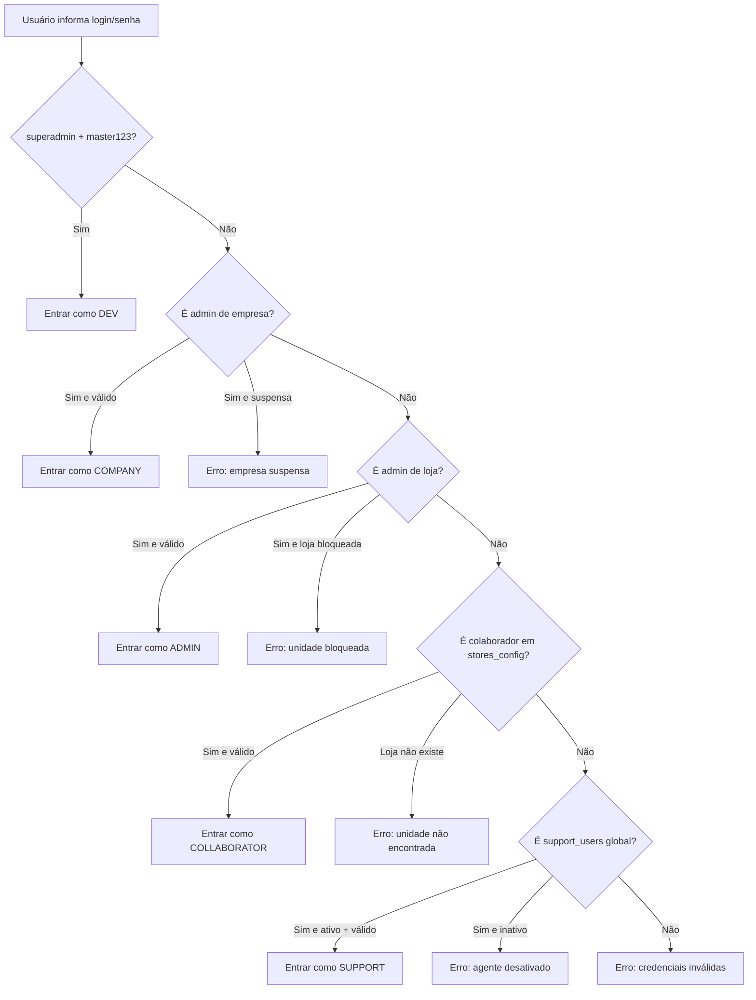
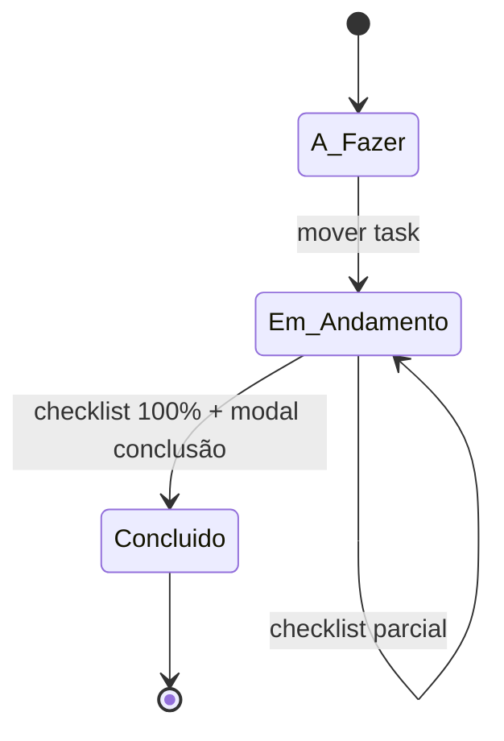
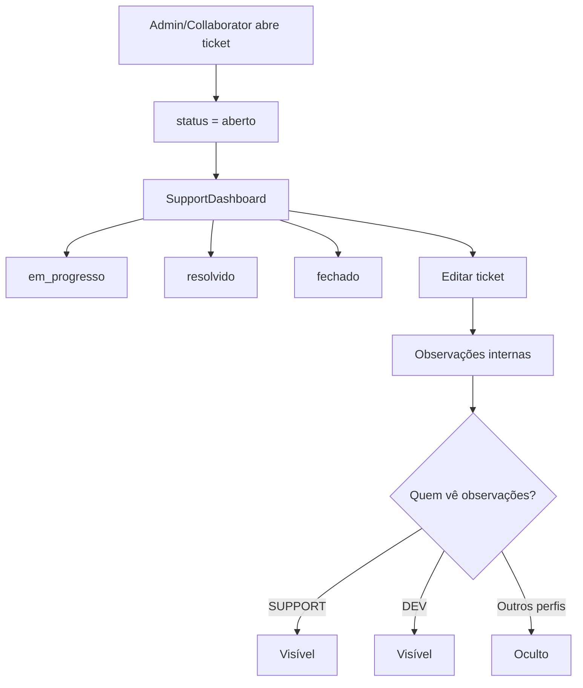

# Fluxo do Sistema — Painéis e Permissões

Este documento mostra, de forma visual, como o sistema funciona hoje: autenticação, roteamento por perfil e o que cada usuário pode acessar/editar.

## 1) Perfis do sistema

- `superadmin` (Role.DEV)
- `company` (Role.COMPANY)
- `admin` (Role.ADMIN)
- `support` (Role.SUPPORT)
- `collaborator` (Role.USER)

---

## 2) Fluxo de Login (detecção de perfil)



---

## 3) Roteamento principal por perfil

```mermaid
flowchart LR
    L[Login OK] --> R{Perfil}

    R --> DEV[DEV]
    R --> COMPANY[COMPANY]
    R --> SUPPORT[SUPPORT]
    R --> ADMIN[ADMIN]
    R --> USER[COLLABORATOR]

    DEV --> DEV1[Painel Empresas]
    DEV --> DEV2[Painel Dev-Support]

    COMPANY --> C1[SuperAdminDashboard modo COMPANY]

    SUPPORT --> S1[SupportDashboard]

    ADMIN --> A1[Operação/Kanban]
    ADMIN --> A2[Equipe]
    ADMIN --> A3[Relatórios]
    ADMIN --> A4[Ouvidoria]
    ADMIN --> A5[Suporte: abrir ticket + meus tickets]

    USER --> U1[Operação/Kanban (sem ações admin)]
    USER --> U2[Equipe (visual)]
    USER --> U3[Relatórios (visual)]
    USER --> U4[Ouvidoria]
    USER --> U5[Suporte: abrir ticket + meus tickets]
```

---

## 4) Matriz de permissões por painel

| Painel / Módulo | DEV | COMPANY | ADMIN | SUPPORT | COLLABORATOR |
|---|---:|---:|---:|---:|---:|
| Gestão de Empresas | ✅ total | ⚠️ escopo próprio | ❌ | ❌ | ❌ |
| Gestão de Unidades | ✅ total | ✅ da empresa | ❌ | ❌ | ❌ |
| Gestão de Agentes de Suporte | ✅ (aba Dev-Support) | ❌ | ❌ | ❌ | ❌ |
| Kanban / Operação (tasks) | ❌ (não usa fluxo operacional) | ❌ | ✅ criar/mover/excluir task | ⚠️ sem painel operacional | ⚠️ visual + ações limitadas |
| Equipe (escalas/rotinas/membros) | ❌ | ❌ | ✅ editar via TeamSettingsModal | ❌ | ⚠️ visual |
| Relatórios | ❌ | ❌ | ✅ | ❌ | ✅ visual |
| Ouvidoria / Feedback | ❌ | ❌ | ✅ responder | ❌ | ✅ enviar |
| Suporte (SupportDashboard) | ❌ | ⚠️ por companyId | ❌ | ✅ global | ❌ |
| Abrir ticket (UserTicketCreation) | ❌ | ❌ | ✅ | ❌ | ✅ |
| Ver próprios tickets (MyTickets) | ❌ | ❌ | ✅ | ❌ | ✅ |

Legenda:
- ✅ permitido
- ⚠️ permitido com restrição de escopo
- ❌ não disponível no fluxo atual

---

## 5) Fluxo operacional de tarefas (ADMIN/COLLABORATOR)



Regras importantes:
- Para concluir task em `Em Andamento`, checklist deve estar completo.
- Na conclusão, pode anexar evidências (attachments) e registrar auditoria de foto (upload).

---

## 6) Fluxo de suporte (tickets)



Observação atual:
- A opção de apagar ticket foi removida do fluxo.

---

## 7) Escopo de dados (resumo mental)

- **DEV:** visão global administrativa (empresas + suporte global técnico).
- **COMPANY:** visão de unidades da própria empresa.
- **ADMIN/COLLABORATOR:** foco em `storeId` da unidade.
- **SUPPORT:** visão global de tickets de suporte.

---

## 8) Notificações Push (resumo)

Atualmente o sistema envia push para:
- Ticket criado
- Ticket atualizado (status/resolução/observações)
- Alteração de horário
- Nova rotina cadastrada
- Tarefa designada / reatribuída
- Disparo manual (incluindo aviso de manutenção)

Canais:
- Web (desktop)
- Smartphone (navegador/PWA)

---

## 9) Leitura rápida: “quem faz o quê”

- **DEV**: administra estrutura global e suporte técnico.
- **COMPANY**: gerencia unidades da empresa.
- **ADMIN**: opera loja, equipe, relatórios e suporte (abrir/ver próprios tickets).
- **SUPPORT**: centraliza atendimento dos tickets.
- **COLLABORATOR**: executa operação e abre chamados quando necessário.
